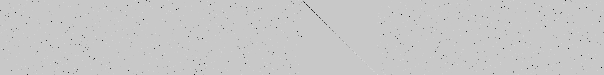

+++
title = 'FlagGPT-3.5'
date = 2024-05-01T07:07:07+01:00
draft = false
+++
# FlagGPT-3.5

## Introduction

This challenge is presented as a web page reproducing the look of the OpenAI's ChatGPT interface. You can interact with the system by writing a message in the AI chat, and the system answers whether your message is the correct flag or not.

The goal is to find the message (i.e. the flag) that will give you a positive answer.

## Discovery

Looking at the browser's network tab, we see that sending a message and getting an answer does not use the network, i.e. the entire process happens on our computer. So let's look at the interesting files we have locally:

- `index.js`: A small JS file containing the page's logic (handling input message, writing output answer)
- `model.wasm`: A mysterious compiled program
- `model.txt`: A human-readable list of operations involving matrices

Following the events happening between the user sending a message the the system outputing an answer, we see that the following steps are done in `index.js`:

1. The user input (string of max. 32 characters) is converted to an array of floats. Each character is converted to its ASCII code, and each of the 8 bits are then converted to a float (either 0.0 or 1.0). The result is an array of 256 float values.
```javascript
t = e.split("").flatMap(e=>e.charCodeAt(0).toString(2).padStart(8, "0").split("").map(parseFloat))
i = new Float32Array(256)
i.set(t)
```
2. An array called `mainParams` is obtained, composed of `256x2048` float values.
3. A function `main` from the compiled program is executed, given as parameters both float arrays obtained in steps 1. and 2.
```javascript
t = this.main(e, this.mainParams).toArray()
```
4. The output of the call to `main` is an array of 2 floats. The system checks that both values are equal to `127`, indicating that the input was the correct flag.
```javascript
t.every(e=>127 == e)
```

Therefore, the goal is to find the correct combination of 256 binary values that will result in the output `[127, 127]` from the model.

## The param matrix

As discovered before, the provided code uses a matrix of `256x2048` binary values as some sort of model parameters. We extract this matrix and save it as an image showing the `0` (black) and `1` (gray) values more clearly:



We can see that the matrix is dense, with a lot of `1`s and a few `0`s. We also see that it's composed of 8 blocks of shape `256x256` stacked side by side.

Looking at the individual blocks:

- All blocks except the 5th have the property of having exactly one `0` value in any given row or column.
- The 5th block is close to being an (inverted) diagonal matrix, with some `0`s missing.

## Understanding the model

At the top of the webpage, we can find a link to a file `model.txt` which seems to describe the operations done in the function `main`. We see the following functions, and guess their effect based on their signature and by playing with the model using various inputs and params (we ignore the operations starting with `vm.builtin.`, because their name is self-explanatory and their effect does not affect our understanding of the `main` function):

- `matmul`: matrix multiplication of two input matrices
- `relu`: element-wise rectified linear unit operation (i.e. `f(x) = 0 if x < 0 else x`)
- `add`: element-wise adds 1 to the input matrix
- `sum`: sum of all the elements of the input matrix
- `concatenate`: combines two inputs into a single matrix
- `transpose`: matrix transpose operation
- `split`: splits the input matrix into 8 blocks of the same shape (in our case the `2048x256` input matrix is split into 8 `256x256` blocks)
- `tir_negative`: element-wise opposite of the input matrix
- `multiply`/`add1`: combined together, 

We simplify the `model.txt` file by removing all of the `vm.builtin.` calls, and obtain the following operations:

```wasm
@main:
// 1.
  call  transpose        in: %1, %3
  call  tir_negative     in: %3, %5
  call  add              in: %5, %6

// 2.
  call  split            in: %6, %7, %9, %11, %13, %15, %17, %19, %21

// 3.
  call  matmul           in: USER_INPUT, %7, %24
  call  relu             in: %24, %26
  call  matmul           in: %26, %9, %27
  call  relu             in: %27, %28
  call  matmul           in: %28, %11, %29
  call  relu             in: %29, %30
  call  matmul           in: %30, %13, %31
  call  relu             in: %31, %32

// 4.
  call  multiply         in: %33, c[43], %34
  call  add1             in: %34, c[45], %35

// 5.
  call  matmul           in: %36, %15, %37
  call  sum              in: %37, %39
  call  sum              in: %36, %41

// 6.
  call  concatenate      in: %42, %43, %45
  ret   %45
```

1. The large `256x2048` weight matrix is first transposed to obtain a `2048x256` matrix. The "bits" are then flipped using the `tir_negative` and `add` operations.
2. The large weight matrix is split into 8 blocks of `256x256` values.
3. The provided input then goes through a series of matrix multiplications followed by relu operations. Knowing that each matrix has exactly one `1` value in any given row or column, the matrix multiplication only moves the input's values without losing information. We also know that the input of the relu operations are only composed of `0`s and `1`s, therefore they are effectively no-ops.
4. The 2 following operations are more mysterious. To find their effect, we try multiple input/param combos such that we can simulate the steps 1-3, and reverse the steps 5-6, and we observe the transformation made by the `multiply`/`add1` block. We conclude that given a vector input, the values with an even index are swapped.
5. Here there are two "branches". On one end, the current vector is summed to obtain a float value. On the other hand, the vector is multiplied one final time with the almost-diagonal matrix that we see in the weight image above, and the result is summed.
6. The resulting sums are then concatenated and returned together.

## The solution

We now understand the goal: We need to find an input such that the result of both sums in step 5. are equal to `127`. Knowing that the 5th weight block (which is used in this step) is composed of exactly `127` `1`s on the diagonal, the only correct solution will give as an input to the step 5. a vector containing `1`s and `0`s that match exactly the diagonal of the 5th weight block.

To find the correct input, we initialize our vector with the values of the diagonal of the 5th weight block. We go in reverse through the steps 4. and 3., and obtain the correct input vector:

```python
# [...] load the weight matrix and split it into blocks

# build an initial vector using the diagonal of the 5th weight block
diag = []
for i in range(256):
    diag.append(w4_15[i, i])

# reverse step 4.
for i in range(len(diag)):
    if i % 2 == 0:
        diag[i] = 1 if diag[i] == 0 else 0

# reverse step 3.
inputs = np.array(list(range(256)))

x = inputs @ w0_7
x = np.maximum(x, 0)
x = x @ w1_9
x = np.maximum(x, 0)
x = x @ w2_11
x = np.maximum(x, 0)
x = x @ w3_13
x = np.maximum(x, 0)

out = [0] * 256

for i in range(256):
    idx = x[i]
    out[idx] = diag[i]

# decode the characters from the ASCII codes
while len(out):
    char_bin = out[:8]
    out = out[8:]

    char = 0
    for i in range(8):
        char += char_bin[i] * (2 ** (7 - i))
    print(chr(char), end="")

# the correct input (i.e. the flag) is found!
```
