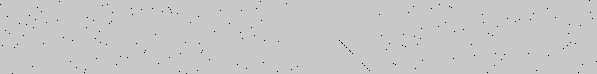

# FlagGPT-4

## Introduction

This challenge is based on the FlagGPT-3.5 challenge. Please start by reading the [FlagGPT-3.5 writeup](TODO). The structure of the challenge is the same. The only differences are as follow:

- The `params` matrix contains different values, while keeping the same properties:



- The list of operations in `model.txt` is slightly different
- The output of the call to `main` is a single float, and the system checks that the value is equal to `31337`:
```javascript
t.every(e=>31337 == t[0])
```

## Understanding the model

The operations used previously in the FlagGPT-3.5 challenge are still valid here. However, there are a few new operations (note that the constants can be discovered by playing with the model using various inputs and params):
- `equal`: checks that the input is equal to a mysterious constant (`137`), returns either `0` or `1`
- `multiply1`: multiplies two inputs together
- `multiply2`: multiplies the input by a mysterious constant (`31337`, a prime number)

## Understanding the model

```wasm
@main:
// <===== Same as FlagGPT-3.5
  call  transpose        in: %1, %3
  call  tir_negative     in: %3, %5
  call  add              in: %5, %6
  call  split            in: %6, %7, %9, %11, %13, %15, %17, %19, %21
  call  matmul           in: %0, %9, %24
  call  relu             in: %24, %26
  call  matmul           in: %26, %13, %27
  call  relu             in: %27, %28
  call  matmul           in: %28, %13, %29
  call  relu             in: %29, %30
  call  matmul           in: %30, %21, %31
  call  relu             in: %31, %32
  call  multiply         in: %33, c[43], %34
  call  add1             in: %34, c[45], %35
// =====>

  call  matmul           in: %36, %15, %41
  call  sum              in: %41, %42
  call  equal            in: %42, %44
  call  sum              in: %36, %45
  call  equal            in: %45, %47
  call  multiply1        in: %44, %47, %49
  call  multiply2        in: %49, %52
  ret   %52
```

This time, the outupt of the last `multiply2` operation must be `31337`, therefore the output of the `multiply1` operation must be `1`. To this end, the result of both `sum` operations must be `137`. Similarly to the previous challenge, the 5th weight block is composed of exactly `137` `1`s on the diagonal, therefore the only correct solution will give as an input to the step 5. a vector containing `1`s and `0`s that match exactly the diagonal of the 5th weight block.

## The solution

Using the same method as the previous challenge, we initialize our vector with the values of the diagonal of the 5th weight block and reverse the model operations to find the correct input:

```python
# [...] load the weight matrix and split it into blocks

# build an initial vector using the diagonal of the 5th weight block
diag = []
for i in range(256):
    diag.append(w4_15[i, i])

# reverse steps
for i in range(len(diag)):
    if i % 2 == 0:
        diag[i] = 1 if diag[i] == 0 else 0

inputs = np.array(list(range(256)))

x = inputs @ w1_9
x = np.maximum(x, 0)
x = x @ w3_13
x = np.maximum(x, 0)
x = x @ w3_13
x = np.maximum(x, 0)
x = x @ w7_21
x = np.maximum(x, 0)

out = [0] * 256

for i in range(256):
    idx = x[i]
    out[idx] = diag[i]

# decode the characters from the ASCII codes
while len(out):
    char_bin = out[:8]
    out = out[8:]

    char = 0
    for i in range(8):
        char += char_bin[i] * (2 ** (7 - i))
    print(chr(char), end="")

# the correct input (i.e. the flag) is found!
```
